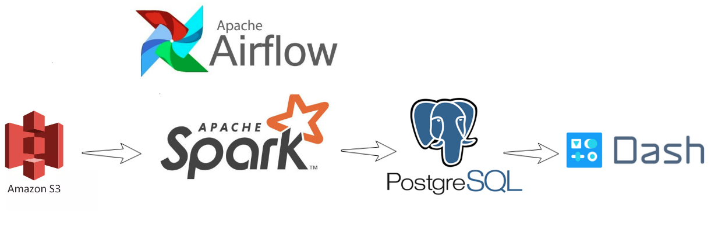

# Trend Factor: Visualizing web trends using the Common Crawl

This is a project I completed in 3 weeks during the Insight Data Engineering Program (New York, 19A Session). The goal of this project is to count the number of web pages that mention a set of terms between January and December 2018. The program uses a subset (~20TB) of the [Common Crawl](https://commoncrawl.org/), an archive of web page content. The results can be used to help companies measure brand recognition over a period of time or compare the popularity of different products. A sample batch job has been executed with a set of database names and the UI with the results is displayed at [techwebtrends.xyz](http://techwebtrends.xyz).

# Pipeline
The data was ingested from Amazon S3 using Spark Scala and the final results containing the search terms and their frequencies were saved to PostgreSQL database. Apache Airflow was used for scheduling the batch processing tasks corresponding to each month of the Common Crawl data. 

